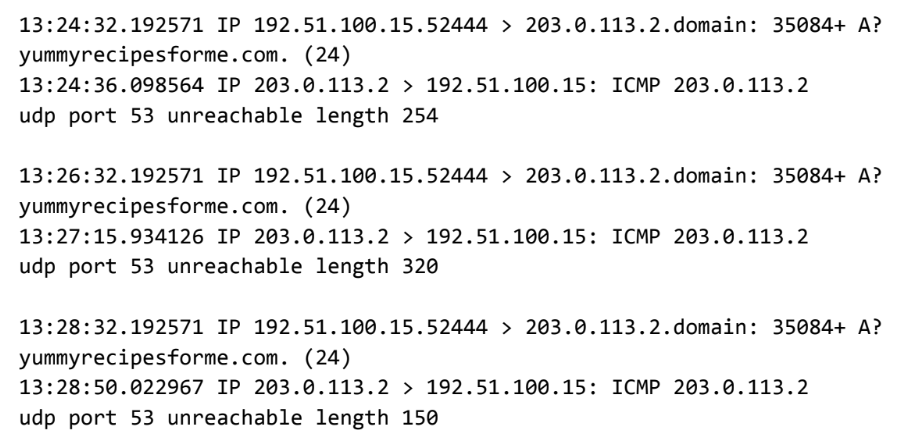

# DNS and ICMP Traffic Analysis for Cybersecurity Incident

## Overview

In this activity, we will analyze DNS and ICMP traffic in transit using data from a network protocol analyzer tool. By identifying which network protocol was utilized in the assessment of the cybersecurity incident, we will help determine which network services were impacted.

In the Internet Layer of the TCP/IP model, IP formats data packets into IP datagrams. The information provided in the datagram of an IP packet can provide security analysts with insight into suspicious data packets in transit. Being able to recognize potentially malicious traffic is crucial in assessing security risks and reinforcing network security.

This activity will guide you through identifying network traffic issues and understanding how to troubleshoot network-related problems.

---

## Scenario

You are a cybersecurity analyst working at a company that provides IT services for clients. Several customers have reported that they cannot access the client company website, *www.yummyrecipesforme.com*, and are seeing the error message **“destination port unreachable”** after waiting for the page to load.

Your task is to analyze the situation and determine which network protocol was affected during this incident. To begin, you attempt to visit the website and receive the same error message. To troubleshoot the issue, you load your network analyzer tool, `tcpdump`, and attempt to load the webpage again. 

To load the webpage, your browser sends a query to a DNS server via the **UDP protocol** to retrieve the IP address for the website's domain name. This is part of the **DNS protocol**. Your browser then uses this IP address as the destination IP for sending an HTTPS request to the web server to display the webpage. 

The analyzer shows that when you send UDP packets to the DNS server, you receive ICMP packets containing the error message: **“udp port 53 unreachable.”**

)

---

## Log from tcpdump Packet Data

In the `tcpdump` log, you find the following information:

- The first two lines of the log file show the initial outgoing request from your computer to the DNS server requesting the IP address of *yummyrecipesforme.com*. This request is sent in a **UDP packet**.
- The third and fourth lines of the log show the response to your UDP packet. In this case, the **ICMP 203.0.113.2** line is the start of the error message indicating that the UDP packet was undeliverable to port 53 of the DNS server.

In front of each request and response, you find timestamps that indicate when the incident happened. The first sequence of numbers displayed is `13:24:32.192571`. This means the time is 1:24 p.m., 32.192571 seconds.

After the timestamps, you will find the source and destination IP addresses. In the first line, where the UDP packet travels from your browser to the DNS server, this information is displayed as:

The IP address to the left of the greater than (>) symbol is the source address (your computer’s IP address). The IP address to the right of the greater than (>) symbol is the destination address (the DNS server IP).

For the ICMP error response, the source address is `203.0.113.2` and the destination is your computer's IP address `192.51.100.15`.

After the source and destination IP addresses, there are additional details like the protocol, port number of the source, and flags. For example, the query identification number is displayed as `35084`, and the plus sign after it indicates there are flags associated with the UDP message. The `A?` flag indicates a request for an **A record** in the DNS protocol, where an A record maps a domain name to an IP address.

The third line shows the protocol of the response message to the browser: **ICMP**, followed by an ICMP error message.

The error message `udp port 53 unreachable` indicates that the UDP message requesting an IP address for *yummyrecipesforme.com* did not go through to the DNS server because no service was listening on the receiving DNS port (Port 53).

The remaining lines of the log show that ICMP packets were sent two more times, but the same delivery error was received both times.

---

## Conclusion

Now that you've captured data packets using a network analyzer tool, it's your job to identify which network protocol and service were impacted by this incident. The issue appears to have been caused by a failure in the DNS service, specifically due to an unreachable port 53. As an analyst, you will report these findings to your supervisor for further investigation by the security engineering team.

In the next stages of this course, you will be asked to demonstrate how to manage and resolve incidents. For now, focus on analyzing the situation and understanding the root causes of the issue.

---

# Cybersecurity Incident Report: Network Traffic Analysis

## Summary of the Problem Found in the DNS and ICMP Traffic Log

As part of the DNS protocol, the host sent a request to the DNS server to retrieve the IP address of the domain *www.yummyrecipeforme.com*. The request is sent in a **UDP packet** and can be found in the first two lines of the log file indicating the outgoing request from your computer. The **ICMP** responds with an error message alerting issues with the DNS server. In this case, the `ICMP 203.0.113.2` line in the log file marks the start of the error message received from the DNS server to your browser: **"udp port 53 unreachable"**.

Port 53 is used for **DNS protocol traffic**. This indicates an apparent issue with the DNS server because the plus sign after the query identification `35084` shows that there are flags with the **UDP message**. The `A` flag indicates a request for an **A record** in the DNS operation.

Due to the **ICMP error message**, the most likely issue is that the DNS server might have been flooded with numerous ICMP messages, which overwhelmed its processing capabilities and caused it not to respond.

---

## Analysis of the Data and Possible Cause of the Incident

### Time Incident Occurred:
The incident took place today at **1:43 p.m.** Several customers of the client reported that they were unable to access the website *www.yummyrecipeforyou.com* and saw the error **"destination port unreachable"** after waiting for the page to load.

The **IT security team** investigated the incident and found that the DNS server and **ICMP protocol** were likely compromised by analyzing traffic with a packet sniffing tool, `tcpdump`. From the resulting log file, it was determined that **DNS port 53 was unreachable**. The server might be down due to a **successful Denial of Service (DoS) attack**.

